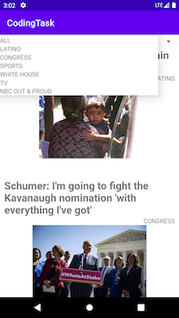

## Coding Task App

## DESCRIPTION
-  An app that presents a collection of news items loaded from the data feed below

## LINKS
-  https://s3.amazonaws.com/shrekendpoint/news.json (json data feed)
-  https://paper.dropbox.com/doc/NBC-News-Coding-project-spec-for-Maryana--BBSQ8HU2zoPzKMQXzvHHGAHwAg-kEfnnceKDzsF6dc1oK9c3

## DEVICES
- [x] Phone

## SCREENSHOTS

## Setup/Installation

**Requirements**

To run this program, you have to have Android Studio or Terminal.

